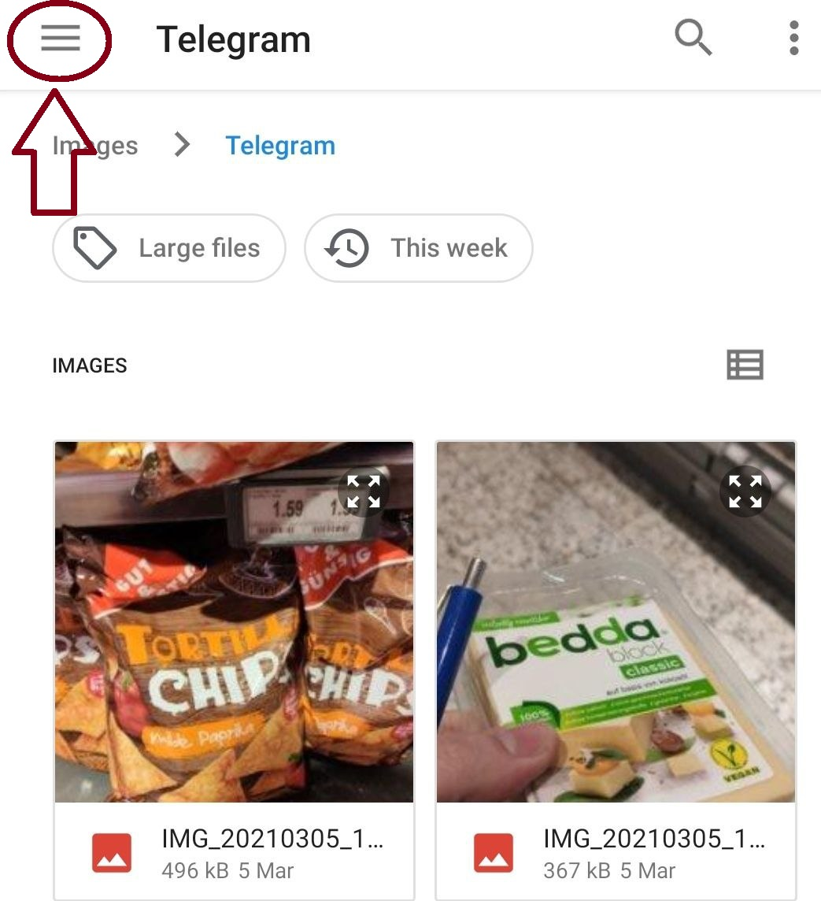
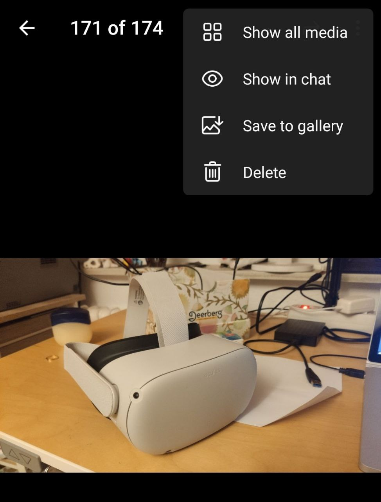

# Help Page
### [Deutsche Version / German Version](https://therdavid.github.io/Memory-Mansion-VR-Landing-Site/index-de)

## Make sure that you have watched the intro videos, for further help see below:

### How to put on the headset (see video below or download instructions document).
<iframe width="840" height="472" src="https://www.youtube.com/embed/m-xlKRM7uyY" title="YouTube video player" frameborder="0" allow="accelerometer; autoplay; clipboard-write; encrypted-media; gyroscope; picture-in-picture" allowfullscreen></iframe>
### How to use the mobile app (see video below or download instructions document).
<iframe width="230" height="472" src="https://www.youtube.com/embed/pohtWnsrQVk" title="YouTube video player" frameborder="0" allow="accelerometer; autoplay; clipboard-write; encrypted-media; gyroscope; picture-in-picture" allowfullscreen></iframe>
### How to use the vr app (see video below or download instructions document).
<iframe width="840" height="840" src="https://www.youtube.com/embed/0gV3oTk5dLs" title="YouTube video player" frameborder="0" allow="accelerometer; autoplay; clipboard-write; encrypted-media; gyroscope; picture-in-picture" allowfullscreen></iframe>

### Mobile Companion App
  - [Take voice note](#taking-a-voice-note)
  - [Transfer files that were created by other apps](#transfer-files-that-were-created-by-other-apps)
  - [Transfering files without the mobile app](#transfering-files-without-the-mobile-app)
  - [Why isn't it sending my files?](#why-isnt-the-app-sending-my-files)
  - [What is the security code for?](#what-is-the-security-code-for)
  - [What does _Allow Cloud Voice Transcription_ mean?](#what-does-allow-cloud-voice-transcription-mean)
  - [What does _Allow Cloud Text Sentiment Analysis_ mean?](#what-does-allow-cloud-text-sentiment-analysis-mean)
  
### VR App
  - [Starting the VR App](#starting-the-vr-app)
  - [Making a video recording / taking a snapshot](#making-a-video-recoding-taking-a-snapshot)
  - [I'm too close to the floor / too high up](#im-too-close-to-the-floor--too-high-up)
  - [Why does it crash?](#q-why-does-the-vr-app-crash)
  - [I can't change things in my room anymore](#q-i-cant-change-things-in-my-room-anymore)
  - [Why does the headset show me my real life surroundings?](#q-why-does-the-headset-show-me-my-real-life-surroundings)
  - [I can't hear music / video sounds](#i-cant-hear-music-video-sounds)
  
### Other
  - [What else can I do with the VR headset?](#q-what-else-can-i-do-with-the-headset)
  - [I am worried about my privacy](#q-i-am-worried-about-my-privacy)
  - [I don't know what I am supposed to do](#q-i-dont-know-what-i-am-supposed-to-do)
  - [I can't find a photo / video but I know it's on my phone](#q-i-cant-find-a-photo--video-but-i-know-its-on-my-phone)
 
   
- [Contact](#contact) 

## Mobile Companion App
**All of this information can be found within the app itself by pressing the gear-icon and selecting _Help and Instruction_**

### **Taking a voice note**
<iframe width="560" height="525" src="https://www.youtube.com/embed/yRp_i_DIQ8w" title="YouTube video player" frameborder="0" allow="accelerometer; autoplay; clipboard-write; encrypted-media; gyroscope; picture-in-picture" allowfullscreen></iframe>

### **Transfer files that were created by other apps**
<iframe width="700" height="315" src="https://www.youtube.com/embed/b_S0pzkSiM0" title="YouTube video player" frameborder="0" allow="accelerometer; autoplay; clipboard-write; encrypted-media; gyroscope; picture-in-picture" allowfullscreen></iframe>

### **Transfering files without the mobile app**
<iframe width="560" height="315" src="https://www.youtube.com/embed/MZynBFun4fU" title="YouTube video player" frameborder="0" allow="accelerometer; autoplay; clipboard-write; encrypted-media; gyroscope; picture-in-picture" allowfullscreen></iframe>

### **Why isn't the app sending my files?**
- Check that the headset is turned on
- Check that the headset connected to the same WiFi as your phone
- Make sure that the app is using the same security code as the headset (check the Quest Companion app below the Memory Mansion app)
- Check your notifications, has the sending maybe started but is taking long due to large amounts of data or a poor WiFi connection?
Feel free to call or text me:

E-Mail: d.p.rosenbusch@gmail.com

Phone: +49 157757 04560

### **What is the security code for?**
To protect your privacy the app will not send the memory files to your headset via the internet, but merely over your own private WiFi network. This means that your memories are not uploaded to some server. To add an additional layer of protection (in case someone breaks into your private home network), the app encryptss your memories, which can only be decrypted using the security code, which you hand-type into the headset.

Feel free to [contact](#contact) me if you have further questions.

### **What does _Allow Cloud Voice Transcription_ mean?**
To turn spoken words into written text with as few hiccups as possible, we're using state of the art speech recoginizing powered by Google. If you enable this feature, your voice recording is temporarily uploaded to a google-server over the internet. There it is turned into written text and sent back to the headset. Google will then delete the recording from their server. They also don't know who it is coming from.

We understand that you may have reservations with personal information being transmitted this way, which is why this feature is disabled by default. You can still listen to your voice recordings, but the diary won't have written information about its content.

### **What does _Allow Cloud Text Sentiment Analysis_ mean?**
To analyze a text's mood, we're using state of the art language analysis powered by google. If you enable this feature, your text notes are temporarily uploaded to a google-server over the internet. There they will be analyzed and a sentiment value is sent back to the headset. Google will then delete the text from their server. They also don't know who it is coming from.

We understand that you may have reservations with personal information being transmitted this way, which is why this feature is disabled by default. If you do not turn on this feature, the app will attempt to perform a very basic sentiment analysis locally (i.e. without sharing the text content with anyone), but it will likely be less accurate.

## VR App
**All of this information can be found in the Lobby (the first room in the VR App)**

### **Starting the VR App**
<iframe width="560" height="560" src="https://www.youtube.com/embed/di3ecvQWWY0" title="YouTube video player" frameborder="0" allow="accelerometer; autoplay; clipboard-write; encrypted-media; gyroscope; picture-in-picture" allowfullscreen></iframe>

### **Making a video recording / taking a snapshot**
Short-press the oculus button and select **Record** from the menu-bar. Short-press the oculus button again to dismiss the menu-bar.
<iframe width="560" height="315" src="https://www.youtube.com/embed/xUm3WGyh4eU" title="YouTube video player" frameborder="0" allow="accelerometer; autoplay; clipboard-write; encrypted-media; gyroscope; picture-in-picture" allowfullscreen></iframe>

### **I'm too close to the floor / too high up**
It is likely that the headset got confused about your position. Please long-press the oculus button (see video below)
<iframe width="560" height="315" src="https://www.youtube.com/embed/RWmbNHg-fJI" title="YouTube video player" frameborder="0" allow="accelerometer; autoplay; clipboard-write; encrypted-media; gyroscope; picture-in-picture" allowfullscreen></iframe>

### **Q: Why does the VR app crash?**
It really shouldn't! If you experience a crash or unexpected behaviour, please contact me immediatly and tell me exactly what happened.

### **Q: I can't change things in my room anymore**
You can only change the room of the current day, meaning that all rooms of the past can only be visited, but no longer edited. This is to prevent users from altering their memories and distorting them.

E-Mail: d.p.rosenbusch@gmail.com

Phone: +49 157757 04560

### **Q: Why does the headset show me my real life surroundings?**
There are 2 reasons this could happen:
1. It shows you a message to set up your guardian. This is needed so you can create a safe play-area to move in or a stationary area in case you're sitting. It will stop showing you your surroundings once you're done
2. You double-tapped the side of the headset. Double-tap it again to solve this.

### **I can't hear music / video sounds**
Check if the device volume is turned very low. See below video. If that is not the issue and you are sure that the video / audio file in question should have sound, please [contact](#contact) me.
<iframe width="560" height="315" src="https://www.youtube.com/embed/6q-1Fr_psio" title="YouTube video player" frameborder="0" allow="accelerometer; autoplay; clipboard-write; encrypted-media; gyroscope; picture-in-picture" allowfullscreen></iframe>

## Other

### **Q: I am worried about my privacy**
Key facts:
- We will never look at the content of your memories
- Memory is only sent to Google Analysis servers if you **explicitly** state you want to, otherwise none of your memories will be stored outside of the VR headset and your own phone
- At the end of the experiment you can transfer all of your memory content from the headset to your own computer and then delete all your data from the headset, before giving it back
- Your interview results will be anonymized
- If you are still unomfortable, please contact me directly. We can also end the experiment prematurely if you wish.

### **Q: I don't know what I am supposed to do**
Please contact me, you can call me any time or write me an email or text message.

E-Mail: d.p.rosenbusch@gmail.com

Phone: +49 157757 04560

### **Q: I can't find a photo / video but I know it's on my phone**
Hit the top-left menu icon in the file-chooser. Make sure you are looking in the right place (maybe a photo wasn't taken with your camera but sent via WhatsApp?).

Also consider that our app does **not** read your text messages. If a photo was sent to you via a messenger app, you will need to manually save it on your phone so that our app can detect it.

### **Q: What else can I do with the headset?**
You can play games! Check out the installed apps and games by pressing on the grid-symbol at the bottom of the menu screen (see [here](#starting-the-vr-app)).

If you have the headset with the letter **Y**, you will find these cutting edge games installed:

- Beat Saber: A thrilling rhythm game in which you have to slice projectiles with light sabers to the beat of a song
- Super Hot: A shooting game in which time only passes if you move, giving you crucial moments of planning before engaging in combat with an overwhelming amount of enemies

You can also log-in to your netflix account and watch movies in a virtual cinema. Beyond that there is a catalogue of free to play games, either installed or downloadable. Go nuts!
__________________________

## Contact
E-Mail: d.p.rosenbusch@gmail.com

Phone: +49 157757 04560
